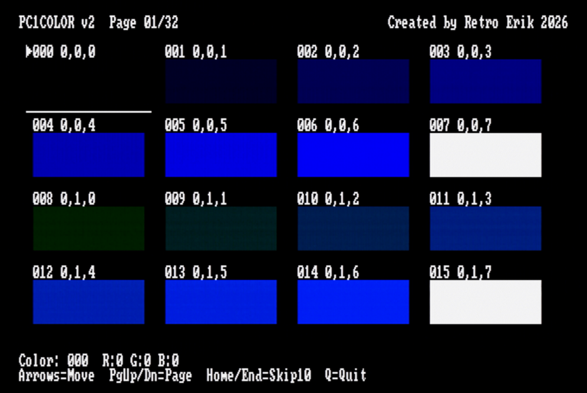

# PC1PAL & PC1PALT - CGA Palette Loaders for Olivetti Prodest PC1

DOS utilities that load custom RGB palettes for CGA games on the Olivetti Prodest PC1. The PC1 uses the Yamaha V6355D video chip with a programmable 16-entry RGB DAC, enabling true RGB color replacement for CGA games.

By **Retro Erik** — [YouTube: Retro Hardware and Software](https://www.youtube.com/@RetroErik)


### 📥 [Download PC1-PAL.zip — all files in one package](PC1-PAL.zip)

<details>
<summary>Individual downloads</summary>

- [PC1PAL.COM](PC1PAL.COM) — One-shot palette loader
- [PC1PALT.COM](PC1PALT.COM) — TSR palette loader with live hotkeys
- [pc1color.com](pc1color.com) — Color finder utility
- [SUNSET.TXT](SUNSET.TXT) — Sunset color palette
- [TANDY.TXT](TANDY.TXT) — Tandy color palette

</details>

### ▶️ [Watch the video on YouTube](https://youtu.be/uqIDscWm9C0)

## Two Versions

| | PC1PAL | PC1PALT |
|---|--------|---------|
| **Type** | One-shot loader | TSR (Terminate and Stay Resident) |
| **Resident memory** | None | ~4 KB |
| **Survives game mode resets** | No | Yes (INT 10h hook) |
| **Live hotkey adjustment** | No | Yes (Ctrl+Alt + key) |
| **Presets** | 3 | 9 + random generation |
| **Color-by-name switches** | No | Yes (/b: and /c:) |
| **Brightness / Saturation** | No | Yes (live adjustment) |
| **Game compatibility** | Best | Most games (see below) |

**Recommendation:** Use **PC1PALT** for most games. Use **PC1PAL** for games that are incompatible with TSR palette loaders (see [Tested Games](#tested-games)).

## PC1PALT — TSR Palette Loader (recommended)

### Features

- **TSR:** Hooks INT 10h to automatically re-apply the palette after CGA mode resets
- **Live hotkeys** via INT 09h (hold Ctrl+Alt and press):
  - **1–9** — Switch between 9 preset palettes instantly
  - **P** — Toggle Pop (saturation + contrast boost)
  - **R** — Reset to default CGA palette
  - **Up / Down** — Brighten / Dim (3 steps each)
  - **Left / Right** — Less / More vivid (saturation, 3 steps)
  - **Space** — Random palette from 15 CGA colors
  - **C** — Random palette from 15 C64 colors
  - **A** — Random palette from 26 Amstrad CPC colors
  - **Z** — Random palette from 14 ZX Spectrum colors
- **9 built-in presets:** Arcade Vibrant, Sierra Natural, C64-inspired, CGA Red/Green, CGA Red/Blue, Amstrad CPC, Pastel, Mono Amber, Mono Green
- **Multi-palette files:** Load up to 9 palettes from one file, accessible via hotkeys 1–9
- **Color-by-name switches:** `/b:darkgray` `/c:lightblue,red,yellow`
- **Brightness, saturation, and pop adjustments** from command line
- **Re-runnable:** Run again with new arguments to update the resident palette
- **Uninstall:** `PC1PALT /U` removes the TSR and restores original interrupt vectors

### Usage

```
PC1PALT [file.txt] [/1..9] [/c:c1,c2,c3] [/b:color]
                    [/P] [/V:+|-] [/D:+|-] [/R] [/U] [/?]
```

| Option | Description |
|--------|-------------|
| `file.txt` | Load palette from text file (default: PC1PALT.TXT) |
| `/1`..`/9` | Load built-in preset palette |
| `/c:c1,c2,c3` | Set colors 1–3 by name |
| `/b:color` | Set background color by name |
| `/P` | Pop — boost saturation + contrast |
| `/V:+` / `/V:-` | Increase / decrease saturation |
| `/D:+` / `/D:-` | Brighten / dim colors |
| `/R` | Install with default CGA palette (hooks active, no custom colors) |
| `/U` | Uninstall TSR from memory |
| `/?` | Show help |

### Examples

```
C:\GAMES> PC1PALT /1
PC1PalT v1.1 - CGA Palette TSR for Olivetti PC1
Preset: Arcade Vibrant
TSR installed. INT 09h + INT 10h hooked.
Ctrl+Alt + key = hotkeys (1-9/P/R/arrows/Space/C/A/Z).

C:\GAMES> LODERUN.EXE
(now use Ctrl+Alt+2 to switch to Sierra Natural, Ctrl+Alt+Up to brighten, etc.)
```

```
C:\GAMES> PC1PALT /c:lightblue,red,yellow /b:darkgray
```

```
C:\GAMES> PC1PALT /U
PC1PalT uninstalled. INT 09h + INT 10h restored.
```

### Built-in Presets

| Preset | Name | Colors (RGB 0-63) |
|--------|------|-------------------|
| `/1` | Arcade Vibrant | Black, Blue(9,27,63), Red(63,9,9), Skin(63,45,27) |
| `/2` | Sierra Natural | Black, Teal(9,36,36), Brown(36,18,9), Skin(63,45,36) |
| `/3` | C64-inspired | Black, Blue(18,27,63), Orange(54,27,9), Skin(63,54,36) |
| `/4` | CGA Red/Green | Black, Red(63,9,9), Green(9,63,9), White |
| `/5` | CGA Red/Blue | Black, Red(63,0,0), Blue(0,0,63), White |
| `/6` | Amstrad CPC | Black, Teal(0,42,42), Olive(42,42,0), White |
| `/7` | Pastel | Black, SkyBlue(27,36,63), Pink(63,36,45), Lavender(54,54,63) |
| `/8` | Mono Amber | Black, DarkAmber(21,14,0), Amber(42,28,0), BrightAmber(63,42,0) |
| `/9` | Mono Green | Black, DarkGreen(0,21,0), Green(0,42,0), BrightGreen(0,63,0) |

### Color Names (for /b: and /c:)

`black`, `blue`, `green`, `cyan`, `red`, `magenta`, `brown`, `lightgray`, `darkgray`, `lightblue`, `lightgreen`, `lightcyan`, `lightred`, `lightmagenta`, `yellow`, `white`

## PC1PAL — One-Shot Palette Loader

The original non-TSR loader. Sets the palette once and exits — no resident code, no interrupt hooks. Best for games that are incompatible with TSR loaders.

### Usage

```
PC1PAL [file.txt] [/1] [/2] [/3] [/R] [/?]
```

| Option | Description |
|--------|-------------|
| `file.txt` | Load palette from text file (default: PC1PAL.TXT) |
| `/1` | Preset: Arcade Vibrant |
| `/2` | Preset: Sierra Natural |
| `/3` | Preset: C64-inspired |
| `/R` | Reset to default CGA palette |
| `/?` | Show help |

## PC1COLOR — Color Finder Utility

Interactive tool for exploring the V6355D's full 512-color palette.

<p>
<em>PC1Color — interactive color finder</em><br>

</p>

On exit, it picks a random farewell message — try it yourself to see them all!

<p>

</p>

## Tested Games

The following games have been tested on real Olivetti Prodest PC1 hardware:

### Works with PC1PALT (TSR)

| Game | Status | Notes |
|------|--------|-------|
| Lode Runner | ✅ Works | Palette survives mode resets, hotkeys work in-game |
| PX3 | ✅ Works | |
| Popcorn | ✅ Works | |

### Requires PC1PAL (one-shot loader)

These games work with both PC1PAL and PC1PALT, but since the palette must be loaded before starting the game (hotkeys don't work in-game), there is no benefit to using the TSR version.

| Game | Notes |
|------|-------|
| Jackson City | Load palette before starting the game |
| Mach 3 | Load palette before starting the game |
| Rick Dangerous | Load palette before starting the game |

### Why some games don't work with the TSR

Some games install their own INT 09h (keyboard interrupt) handler, bypassing or conflicting with the TSR's keyboard hook. This can cause crashes or erratic behavior. These games typically:

- Replace the INT 09h vector entirely for direct keyboard input
- Perform their own keyboard controller I/O (reading port 60h, writing port 61h)
- Chain to the previous INT 09h handler, creating timing conflicts with our hook

**Workaround:** Use **PC1PAL** instead — it loads the palette and exits, leaving no resident code. The palette persists in the V6355D DAC hardware until the next video mode change. For games that reset the video mode during startup, load PC1PAL *after* the game has initialized (if the game has a title screen before gameplay, this may work).

Note that with PC1PAL, the palette will be lost if the game sets a new CGA mode (INT 10h AH=00h, mode 4/5), since there is no resident hook to re-apply it. This is where PC1PALT's TSR approach is needed.

### Hotkey behavior varies by game

Even with games that work with the TSR, the ability to use Ctrl+Alt hotkeys depends on how the game handles the keyboard:

- **Some games let you change colors freely during gameplay.** The hotkeys work at any time.
- **Some games block hotkeys during gameplay but allow them on pause.** Pause the game first, then use Ctrl+Alt hotkeys to adjust the palette.
- **Some games only allow changes on the title screen or high-score screen,** but not during active gameplay. Switch palettes there before starting or resuming play.

## Screenshots

*CGA games running with custom palettes on the Olivetti Prodest PC1:*

<p>
<em>Jackson City — CGA palette 1</em><br>

</p>

<p>
<em>Jackson City — Intro, CGA palette 1</em><br>

</p>

<p>
<em>Mach 3 — CGA palette 5</em><br>

</p>

<p>
<em>Planet X3 — CGA palette 8 (amber)</em><br>

</p>

<p>
<em>Planet X3 — CPC random palette</em><br>

</p>

<p>
<em>Planet X3 — ZX Spectrum random palette</em><br>

</p>

<p>
<em>World Karate — C64 random palette</em><br>

</p>

<p>
<em>World Karate — CGA palette 1</em><br>

</p>

<p>
<em>World Karate — CPC random palette</em><br>

</p>

## Text File Format

Human-readable format with comments. Both PC1PAL and PC1PALT use the same format:

```ini
; SUNSET.TXT - Warm sunset palette
; Values are 0-63 (6-bit RGB)

0,0,0       ; Color 0: Black (background)
63,32,0     ; Color 1: Orange
32,0,16     ; Color 2: Dark Magenta
63,63,32    ; Color 3: Pale Yellow
```

- One RGB triple per line: `R,G,B` or `R G B`
- Lines starting with `;` or `#` are comments
- Blank lines are ignored
- Values must be 0-63 (will be scaled to 0-7 for V6355D)

### Multi-Palette Files (PC1PALT only)

PC1PALT supports up to 9 palettes in one file (4 lines each, 36 lines total). When loaded, they overwrite presets 1–9 and are accessible via Ctrl+Alt+1 through Ctrl+Alt+9:

```ini
; GAME.TXT - Multiple palettes for one game
; Palette 1: Warm
0,0,0
63,32,0
32,0,16
63,63,32
; Palette 2: Cool
0,0,0
0,32,63
0,16,32
32,63,63
```

## Building

Requires [NASM](https://nasm.us/) (Netwide Assembler):

```bash
nasm -f bin PC1PAL.asm -o PC1PAL.COM
nasm -f bin PC1PALT.asm -o PC1PALT.COM
```

## Technical Details

For comprehensive V6355D documentation, see [V6355D-Technical-Reference.md](../V6355D-Technical-Reference.md).

### Hardware

The Olivetti Prodest PC1 uses the **Yamaha V6355D** video controller which has:
- 16-entry programmable palette
- 3-bit per channel RGB DAC (8 levels per color = 512 colors total)
- I/O ports at 0xDD (address) and 0xDE (data)

### V6355D Palette Format

The V6355D uses a packed 2-byte format per palette entry:

| Byte | Bits | Content |
|------|------|---------|
| 1 | 2:0 | Red (0-7) |
| 2 | 6:4 | Green (0-7) |
| 2 | 2:0 | Blue (0-7) |

6-bit input values (0-63) are scaled to 3-bit (0-7) by dividing by 8.

### Palette Write Sequence

Both PC1PAL and PC1PALT write to the V6355D in the same way:

1. Write 0x40 to port 0xDD (enable palette write)
2. Write 32 bytes to port 0xDE (16 colors × 2 bytes each)
3. Write 0x80 to port 0xDD (disable palette write)

> **⚠️ Important:** I/O delays between each palette byte write are required (e.g., `jmp short $+2`). The V6355D requires 300ns minimum I/O cycle time. Without delays, palette writes may be corrupted.

### CGA Mode 4 Palette Mapping

In CGA 320×200 4-color mode, pixel values 0-3 map to DAC entries based on which palette the game uses:

| Pixel | Palette 1 (Cyan/Mag/White) | Palette 0 (Green/Red/Yellow) |
|-------|---------------------------|------------------------------|
| 0 | Entry 0 | Entry 0 |
| 1 | Entry 3 or 11 | Entry 2 or 10 |
| 2 | Entry 5 or 13 | Entry 4 or 12 |
| 3 | Entry 7 or 15 | Entry 6 or 14 |

Both tools write your 4 custom colors to **all** these positions, so the palette works regardless of which CGA palette or intensity the game uses.

### PC1PALT TSR Architecture

PC1PALT hooks two interrupts:
- **INT 10h** — Intercepts `AH=00h, AL=04h/05h` (set CGA mode). Lets the original handler run, then re-applies the custom palette.
- **INT 09h** — Intercepts keyboard scan codes. If Ctrl+Alt is held, checks for hotkeys. Otherwise chains to the original handler transparently.

The TSR uses early keystroke acknowledgment: port 61h is toggled as soon as a hotkey is recognized, before calling the handler. This prevents keyboard lockup on the NEC V40 when DAC writes take time.

Resident size is approximately 4 KB (computed at runtime from the `tsr_end` label).

## Creating Custom Palettes

Use any text editor to create a `.TXT` file:

```ini
; My custom palette
0,0,0       ; Background (usually black)
0,63,63     ; Color 1 (replaces Cyan)
63,0,63     ; Color 2 (replaces Magenta)
63,63,63    ; Color 3 (replaces White)
```

## License

MIT License - See [LICENSE](LICENSE) file

## Author

Dag Erik Hagesæter - 2026

---

## YouTube

For more retro computing content, visit my YouTube channel **Retro Hardware and Software**:
[https://www.youtube.com/@RetroErik](https://www.youtube.com/@RetroErik)
